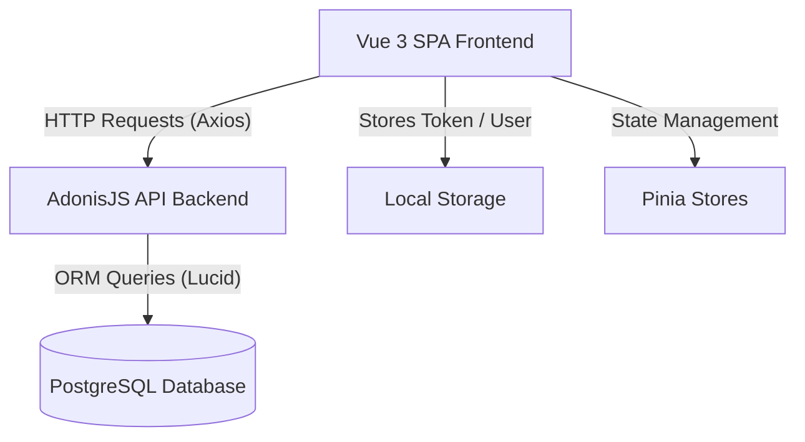

# Full-Stack E-Commerce Web Application (SPA)

This is a modern, responsive, full-stack E-Commerce web application featuring a **Vue 3 Single Page Application (SPA)** frontend and an **AdonisJS API** backend. The system integrates robust state management, role-based access control, secure API authentication, optimistic locking to manage admin conflicts, and a PostgreSQL database.

This project was developed as part of the **NGP Internship program**.

---

## 🏗️ Project Architecture

The project is structured as a client-server architecture:
- **Frontend (Client)**: A Vue 3 SPA built with Vite, utilizing Pinia for state management and Vue Router for navigation. It makes HTTP requests using an Axios client equipped with request and response interceptors (handling automated JWT authentication headers, local storage bindings, logging, and smart 500 error auto-retries).
- **Backend (Server)**: An AdonisJS 5.9 REST API using Lucid ORM to connect to a PostgreSQL database, secured with route middleware for token-based authentication and role enforcement.



---

## 🚀 Key Features

### 👤 Dual-Role Authentication & Access Control
- **Authentication**: Custom authentication using Adonis Auth (API Tokens) for Admins and user profiles.
- **Dynamic Views**: The navigation bar and view configurations dynamically update according to the active user's role.
- **Route Guards**:
  - **Admin Guard**: Restricts sensitive views (`/manage`, `/orders`, `/users`) to authorized administrators, displaying warning toasts to unprivileged users.
  - **Empty Cart Guard**: Restricts navigation to the `/carts` page if the shopping cart is empty, redirecting users to the product view.

### 🛍️ Dynamic Product Catalog
- Product grids displaying cards with custom micro-animations (hover scaling and press effects).
- Client-side sorting (low-to-high, high-to-low price) and debounce-based product search matching the server API.

### 🛒 Shopping Cart & Orders
- Real-time shopping cart powered by Pinia.
- Users can review items, adjust details, delete selections, and proceed to checkout.
- Order placement creating permanent purchase records mapped to logged-in users.

### ⚙️ Administrative Control Panel (`/manage`)
- Full **CRUD** operations for the product database.
- **Optimistic Locking**: Uses a `version` field comparison to prevent concurrent modification conflicts. If another administrator updates a product in the background, a `409 Conflict` response is sent and handled gracefully in the UI.
- Manage user profiles and update order status (e.g., Pending, Completed).

---

## 🛠️ Tech Stack

### Frontend
- **Framework**: Vue 3 (Composition API using `<script setup>`)
- **Build Tool**: Vite
- **Routing**: Vue Router 5
- **State Management**: Pinia 3
- **Styling**: Vanilla CSS (scoped to components) & Vuetify 4 (for layout assets & icons)
- **HTTP Client**: Axios (configured with intercepts, retry policies, and error handling)
- **Notifications**: Vue-Toastification

### Backend
- **Framework**: AdonisJS 5.9 (TypeScript)
- **Lucid ORM**: Database mapping and relationships
- **Database**: PostgreSQL (configured via `pg` client)
- **Authentication**: Adonis API Tokens (JWT/Tokens stored in `api_tokens` table)
- **Hashing**: Phc-Argon2 for passwords

---

## 📂 Directory Structure

```text
Ecommerce/
├── backend/                  # AdonisJS 5.9 API Project
│   ├── app/
│   │   ├── Controllers/Http/ # Auth, Cart, Orders, Products, Users Controllers
│   │   ├── Middleware/       # Admin, Auth, SilentAuth Route Guards
│   │   └── Models/           # Lucid Models (User, Product, Order)
│   ├── config/               # Database, Auth, CORS, and Server Configs
│   ├── database/
│   │   └── migrations/       # PostgreSQL Table Schemas
│   ├── start/
│   │   ├── kernel.ts         # Middleware Registry
│   │   └── routes.ts         # Backend REST API Routes
│   ├── package.json          # Dependencies & Backend Script Definitions
│   └── tsconfig.json         # TypeScript compiler configurations
│
├── frontend/                 # Vue 3 SPA Project
│   ├── public/               # Static Web Assets
│   ├── src/
│   │   ├── assets/           # Main CSS stylesheets
│   │   ├── components/       # Reusable components (NavBar, buttons, etc.)
│   │   ├── router/           # Route registry and navigation guards
│   │   ├── services/         # Axios API connection layer (server.js)
│   │   ├── stores/           # Pinia stores (auth.js, carts.js, products.js)
│   │   └── views/            # Single Page Views (Home, Products, Admin Manage, Orders)
│   ├── package.json          # Dependencies & Frontend Script Definitions
│   └── vite.config.js        # Vite build configurations
```

---

## 💾 Database Schema

The PostgreSQL database maintains the following relationship schemas managed via Lucid ORM:

### 1. `users` Table
- `id` (Primary Key)
- `username` (Unique string)
- `password` (Hashed using Argon2)
- `role` (String, default: `'user'`, admin access requires `'admin'`)
- `phone` / `address` (Metadata string fields)
- Timestamps (`created_at`, `updated_at`)

### 2. `products` Table
- `id` (Primary Key)
- `name` (String)
- `price` (Decimal, 12, 2)
- `image` (Text URL)
- `version` (Integer used for optimistic concurrency control)
- Timestamps (`created_at`, `updated_at`)

### 3. `orders` Table
- `id` (Primary Key)
- `user_id` (Foreign Key referencing `users.id` with CASCADE delete)
- `items` (JSONB format storing purchased products array)
- `total_items` (Integer)
- `total_price` (Decimal, 12, 2)
- `status` (String, e.g., Pending/Delivered)
- `order_date` (Timestamp)
- Timestamps (`created_at`, `updated_at`)

---

## 🏁 Getting Started

Follow these steps to run the complete stack locally.

### Prerequisites
- Node.js (version 22.18.0 or >=24.12.0 recommended)
- PostgreSQL database instance running locally or hosted online.

---

### 1. Backend Setup & Run

1. Navigate to the backend folder:
   ```bash
   cd backend
   ```
2. Install npm dependencies:
   ```bash
   npm install
   ```
3. Configure Environment Variables:
   Copy the example environment file:
   ```bash
   cp .env.example .env
   ```
   Open the `.env` file and set your PostgreSQL database connection variables:
   ```env
   PORT=3333
   HOST=127.0.0.1
   NODE_ENV=development
   APP_KEY=your_app_key_here
   DB_CONNECTION=pg
   PG_HOST=localhost
   PG_PORT=5432
   PG_USER=your_db_username
   PG_PASSWORD=your_db_password
   PG_DB_NAME=your_db_name
   ```
4. Run Database Migrations:
   Create the database schema by executing Adonis migrations:
   ```bash
   node ace migration:run
   ```
5. Start the Development Server:
   ```bash
   npm run dev
   ```
   The backend server runs locally on **`http://127.0.0.1:3333`**.

---

### 2. Frontend Setup & Run

1. Navigate to the frontend folder:
   ```bash
   cd ../frontend
   ```
2. Install npm dependencies:
   ```bash
   npm install
   ```
3. Start the Vite hot-reloading dev environment:
   ```bash
   npm run dev
   ```
   The frontend runs by default on **`http://localhost:5173`**.

---

## 🚀 Quality & Formatting Commands

The frontend and backend use linters and formatters to maintain high-quality code standards:

### Frontend Checks
- **Run all lint checks**: `npm run lint`
- **Lint using ESLint**: `npm run lint:eslint`
- **Lint using Oxlint**: `npm run lint:oxlint`
- **Auto-format code**: `npm run format`

### Backend Checks
- **Lint TypeScript**: `npm run lint`
- **Format code**: `npm run format`
